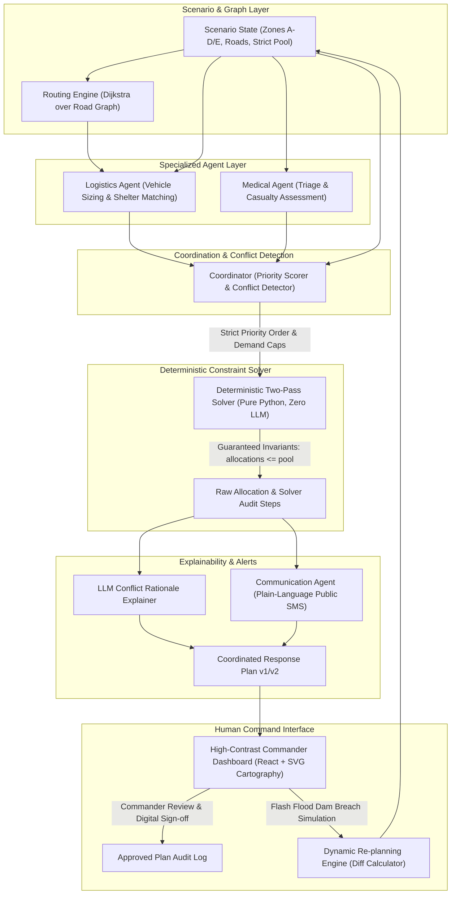

# Multi-Agent Disaster Response Coordinator (Problem HTH-GA-07)

[](https://python.org)
[](https://fastapi.tiangolo.com)
[](https://react.dev)
[](https://vitejs.dev)
[](https://tailwindcss.com)
[]()

A GenAI decision-support emergency management MVP for urban flood crises. It couples three specialized multi-agent reasoning systems (**Logistics**, **Medical**, and **Communication**) with a **deterministic, zero-hallucination resource constraint solver**.

> **Core System Principle:**  
> **GenAI performs reasoning, routing analysis, explanation, and drafting alerts.**  
> **The Deterministic Solver has absolute final authority over all numbers.**  
> The LLM can never over-allocate resources or bypass hard capacity invariants.

---

## 🏛️ System Architecture



---

## 🌟 Key Capabilities & Differentiators

1. **Zero-Hallucination Resource Invariants (`solver.py`)**:
   - Pure Python, 100% deterministic (identical inputs yield identical outputs; ties broken by `zone_id`).
   - Hard mathematical guarantees:
     $$\sum \text{allocated}_r \le \text{pool}_r \quad \forall r$$
     $$\text{shelter\_occupancy} \le \text{shelter\_capacity}$$
     $$\text{allocated} \ge 0, \quad \text{unmet} \ge 0$$
   - **Two-Pass Allocation Algorithm**:
     - **Pass 1**: Guarantees 1 unit of scarce asset (ambulance/vehicle/medic) to zones with critical life-threatening need.
     - **Pass 2**: Distributes remaining scarce units strictly in priority order until the pool is exhausted.
   - Accurately and transparently resolves the **Zone A vs. Zone D ambulance conflict** (Zone A receives 2, Zone D receives 1, with 1 unmet).

2. **Dual-Mode LLM Abstraction (`llm.py` & `base.py`)**:
   - Seamlessly uses **Google Gemini (`google-genai` SDK)** if `GEMINI_API_KEY` is present.
   - Built-in rule-based **`MockLLMClient`** fallback that activates automatically when offline or if API quotas fail. **The demo never breaks.**

3. **Transparent Priority Scoring (0-100)**:
   - Configurable mathematical formula exposing per-factor breakdowns in the dashboard:
     $$\text{Score} = 0.30 \cdot S_{\text{sev}} + 0.25 \cdot S_{\text{crit}} + 0.15 \cdot S_{\text{vuln}} + 0.15 \cdot S_{\text{pop}} + 0.15 \cdot S_{\text{evac}}$$

4. **Dynamic Re-planning with Audit Diffs (`state.py` & `/api/zones`)**:
   - Mid-crisis injection of **Zone E** (Flash flood dam breach, Severity 5, 14 critical patients).
   - Re-plans in seconds, recalculates priority rankings, redistributes resources, and generates a visual diff banner highlighting reallocated cells.

5. **Decision Trace Auditability**:
   - Chronological step-by-step solver audit trail documenting exactly why each unit was awarded or denied.

6. **Human-in-the-Loop Approval Workflow**:
   - "Decision support only" banner ensures compliance with humanitarian protocols. Commanders sign off with their name, notes, and digital audit timestamp.

---

## 🚀 Quick Start Guide

### Prerequisites
- Python 3.11+
- Node.js 18+ & npm

### 1. Installation
Clone the repository:
```bash
git clone <repository_url>
cd Aizen
```

Setup Python environment and dependencies:
```bash
pip install -r backend/requirements.txt
```

*(Or direct pip packages: `fastapi uvicorn pydantic pytest python-dotenv google-genai httpx`)*

Setup frontend:
```bash
cd frontend
npm install
cd ..
```

### 2. Configuration (Optional)
The system is pre-configured to run out of the box with the **Deterministic Mock LLM Engine**.  
To enable live Gemini synthesis, copy `.env.example` to `.env` and supply your Gemini API key:
```bash
cp .env.example .env
```
Edit `.env`:
```env
GEMINI_API_KEY=AIzaSy...
GEMINI_MODEL=gemini-2.5-flash
```

### 3. Launching the System
In Terminal 1 (Backend API):
```bash
python -m uvicorn backend.app.main:app --host 127.0.0.1 --port 8000 --reload
```

In Terminal 2 (Frontend Dashboard):
```bash
cd frontend
npm run dev
```

Open your browser to: **`http://localhost:5173`**

---

## ⏱️ 3-Minute Demo Script for Evaluators

| Step | Action | What to Observe |
| :---: | :--- | :--- |
| **1** | **Open Dashboard** | Inspect the high-contrast cartography. Notice **Zone A to Shelter North road is marked RED & DASHED (BLOCKED)**. Notice the mode badge displays `FALLBACK ENGINE (DETERMINISTIC MOCK)` or `LIVE GEMINI 2.5`. |
| **2** | **Click "Generate Plan"** | Watch the live orchestration status progression: *Logistics Agent $\rightarrow$ Medical Agent $\rightarrow$ Conflict Detection $\rightarrow$ Deterministic Solver*. |
| **3** | **Inspect Resource Gauges** | Ambulances, Vehicles, and Shelters turn **warning red at 100% saturation**. Unmet badges highlight resource scarcity (e.g. 1 ambulance unmet, 20 evacuees unmet). |
| **4** | **Verify A/D Ambulance Conflict** | Look at the **Conflict Resolution Panel**: Notice conflict `CONF-AMB-1`. Zone A (8 critical) and Zone D (6 critical) each requested 2 ambulances against a 3-unit pool. The solver awarded **Zone A: 2**, **Zone D: 1 (1 unmet)** with a transparent rationale. |
| **5** | **Check Interactive Map & Detours** | The map renders animated cyan evacuation corridors. Zone A routes around the blocked northern corridor through Central District (Zone B/C) to Shelter North. |
| **6** | **Expand Priority Score** | In the **Prioritized Sectors** panel, click the expand arrow on Zone A or Zone D to view the exact weighted breakdown (Severity, Critical Patients, Vulnerable Population, Affected Pop, Evac Demand). |
| **7** | **Click "Add Zone E (Flash Flood)"** | Injects Zone E (Dam Breach, Severity 5). Zone E immediately becomes Rank #1. A purple **Dynamic Re-plan Diff banner** appears. The table highlights changed allocations. |
| **8** | **Review Updated Alerts & Copy** | The Draft Public SMS Dispatches panel updates with a `"What Changed"` tag. Click **"Copy SMS"** to copy the formatted advisory. |
| **9** | **Authorize & Approve Plan** | Click **"Approve Plan"**. Enter commander name (e.g. `Commander Sarah Jenkins`), provide audit notes, and click **Authorize**. The plan status locks with a green **APPROVED** badge and audit timestamp. |

---

## 🧪 Comprehensive Automated Test Suite

Run all unit, integration, and property-based tests via pytest:
```bash
python -m pytest backend/tests -v
```

### Test Coverage Highlights:
- `test_routing.py`: Dijkstra shortest path, blocked-road detour avoidance, unreachable destinations.
- `test_solver.py`:
  - Target acceptance test: Zone A / Zone D ambulance conflict resolution (2 to A, 1 to D, 1 unmet).
  - Absolute determinism test (5 consecutive identical runs).
  - Multi-shelter capacity splitting and overflow calculation.
  - **Property-based randomized loop over 200 random scenarios** verifying all mathematical invariants hold without exception.
  - Zone E re-plan solver test.
- `test_coordinator.py`: Priority scoring formula weights and multi-agent conflict detector.
- `test_api.py`: FastAPI REST endpoints (`/api/scenario`, `/api/plan`, `/api/zones`, `/api/plan/approve`, `/api/reset`, `/api/plan/history`).

---

## 📂 Repository Structure

```
Aizen/
├── backend/
│   ├── app/
│   │   ├── main.py              # FastAPI endpoints, CORS, re-plan handlers
│   │   ├── models.py            # Pydantic v2 data models
│   │   ├── state.py             # In-memory scenario state & versioned plan history
│   │   ├── coordinator.py       # Priority scoring & conflict detection engine
│   │   ├── solver.py            # Deterministic two-pass resource constraint solver
│   │   ├── routing.py           # Dijkstra over road graph with blocked road bypass
│   │   ├── llm.py               # GeminiClient and MockLLMClient abstraction
│   │   └── agents/
│   │       ├── base.py          # BaseAgent with JSON validation & retry
│   │       ├── logistics.py     # Logistics Agent (shelters & vehicle demand)
│   │       ├── medical.py       # Medical Agent (triage & ambulance requests)
│   │       └── communication.py # Communication Agent (public SMS broadcasts)
│   ├── data/
│   │   ├── scenario_base.json   # Base scenario (Zones A-D, strict pool, blocked road)
│   │   └── scenario_zone_e.json # Dynamic Zone E flash flood scenario
│   ├── tests/
│   │   ├── test_routing.py      # Dijkstra & road graph tests
│   │   ├── test_solver.py       # Solver invariants, 200 random property tests
│   │   ├── test_coordinator.py # Scoring & conflict detection tests
│   │   └── test_api.py          # REST API integration tests
│   └── requirements.txt         # Backend Python dependencies
├── frontend/
│   ├── src/
│   │   ├── App.jsx              # Command Dashboard Master Component
│   │   ├── index.css            # Dark emergency styling & animations
│   │   └── components/
│   │       ├── Header.jsx       # Decision-support banner, status, actions
│   │       ├── ResourceGauges.jsx # 100% saturation resource bars
│   │       ├── SvgMap.jsx       # Vector cartography with dynamic routing
│   │       ├── PriorityList.jsx # Ranked zones with factor breakdown
│   │       ├── ConflictPanel.jsx# Resolved conflict notifications
│   │       ├── AllocationTable.jsx # Matrix with unmet & diff indicators
│   │       ├── AgentPanels.jsx  # Multi-agent intelligence telemetry
│   │       ├── DecisionTracePanel.jsx # Audit timeline & rationales
│   │       ├── AlertsPanel.jsx  # Editable public SMS cards
│   │       └── ApprovalModal.jsx# Commander sign-off dialog
│   ├── package.json
│   └── vite.config.js
├── .env.example                 # Configuration template
├── README.md                    # Comprehensive documentation
```

---

## 🏆 Hackathon MVP Acceptance Verification

| Requirement | Implementation & Verification Status |
| :--- | :--- |
| **Strict Resource Pool** | Fixed pool: 3 ambulances, 5 vehicles (cap 20), 6 medics, 2 shelters (cap 150 & 100). Never exceeded. |
| **Ambulance Conflict (A vs D)** | Zone A (Score 64.0, 8 crit) receives 2 units; Zone D (Score 57.6, 6 crit) receives 1 unit; 1 unit unmet. |
| **Purely Deterministic Solver** | `solver.py` contains zero LLM calls. Invariant assertion passes across 200 randomized scenarios. |
| **Dual-Mode LLM Resilience** | Operates with live Gemini API key or offline `MockLLMClient`. Zero network failure points. |
| **Dynamic Mid-Crisis Re-plan** | `POST /api/zones` injects Zone E, recalculates plan, shows diff banner, updates alerts in <1 sec. |
| **Decision Trace & Explainability**| Every allocation has a human-readable reason in the audit trace; conflicts clearly explained. |
| **Commander Approval Protocol** | Plans require formal sign-off with call-sign and notes before field dispatch authorization. |
